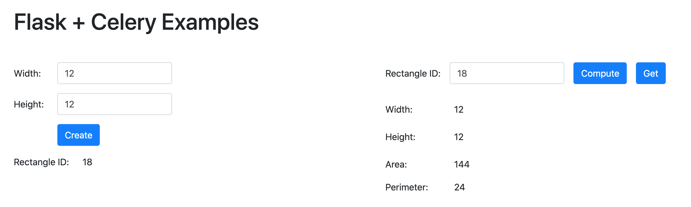
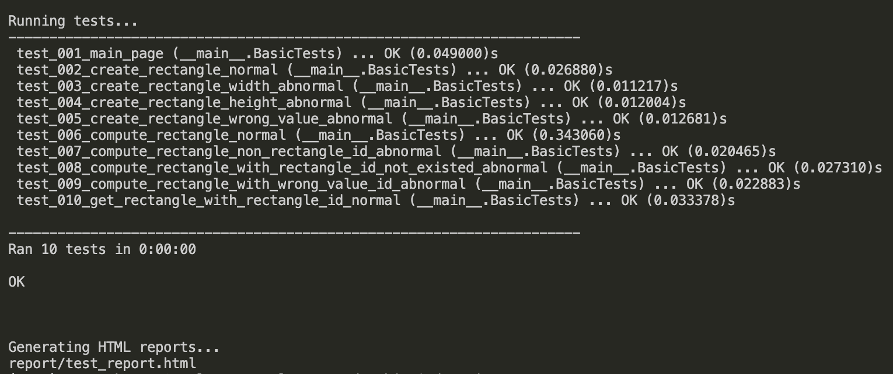
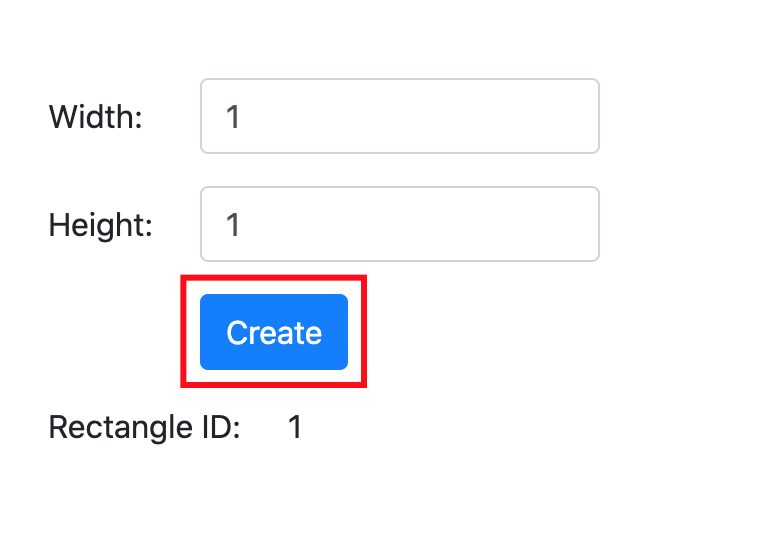
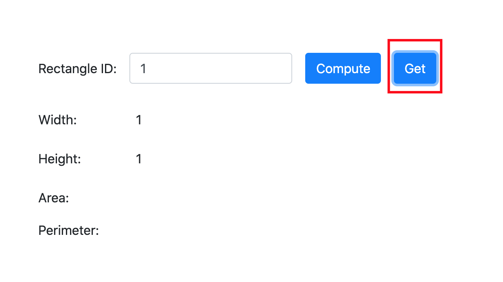
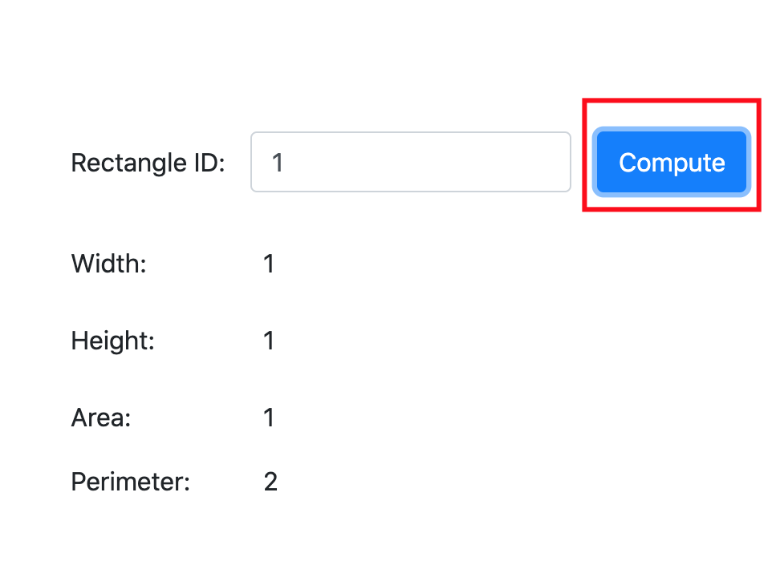

Using Celery with Flask
=======================

This repository contains the example code .

The application provides one example of background tasks using Celery:

- Example: Compute area, perimeter asynchronously.

Here is a screenshot of this application:

Quick Setup
-----------
1. Clone this repository.
2. Move to folder project (celery_example)
3. Create a virtualenv: python3 -m venv venv
4. Install the requirements: `. venv/bin/activate` then `pip install -r requirements.txt`
5. Open a second terminal window and start a local Redis server (if you are on Linux or Mac, execute `run-redis.sh` to install and launch a private copy).
6. Open a third terminal window. Then start a Celery worker: `venv/bin/celery worker -A app.celery --loglevel=info`.
7. Start the Flask application on your original terminal window: `venv/bin/python run.py`.

Run Unittest
-----------
1. Open a new terminal window. Then run python file: `venv/bin/python test.py`.
2. Result in terminal

3. Beside, you can check result by html file in report folder

Using Application
-----------
1. Create new rectangle by click button Create

2. Check rectangle exist on database by click button Get

3. Compute area, perimeter of rectangle by click button Compute

Done!
-----------
